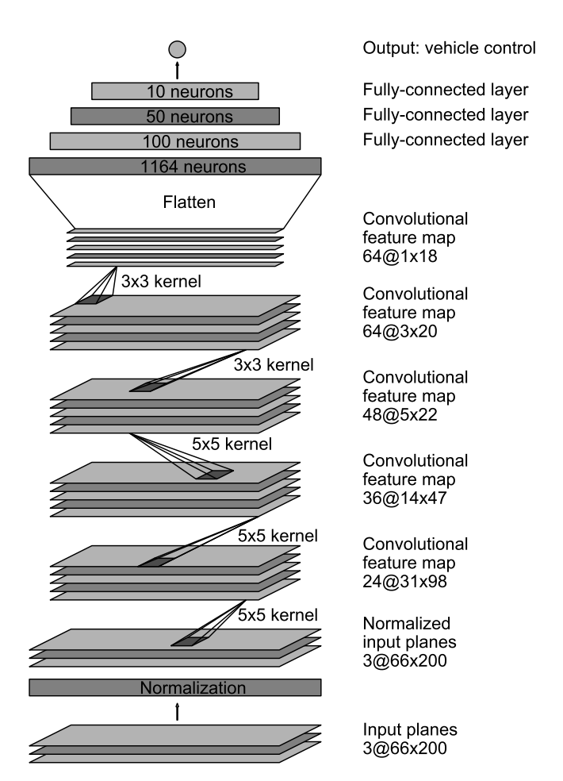
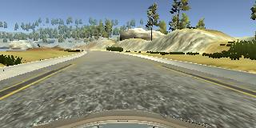
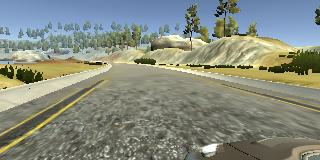
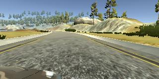
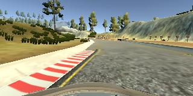
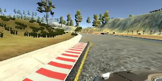
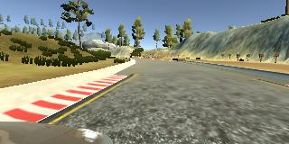

# Behaviorial Cloning with End to End Learning

Overview
---
This project uses Behavioral Cloning to learn from a simulator driving video. Four essential files are summarized as follows
 
* model.py (script used to create and train the model)
* drive.py (script to drive the car)
* model.h5 (Keras implementation of Nvidia proposed End to End learning for self driving cars)
* video.mp4 (a video recording of autonomous simulation for one lap) 

You're not required to use markdown for your writeup.  If you use another method please just submit a pdf of your writeup.

The Project
---
The steps of this project are the following:
* Use the simulator to collect data of good driving behavior 
* Design, train and validate a model that predicts a steering angle from image data
* Use the model to drive the vehicle autonomously around the first track in the simulator. The vehicle should remain on the road for an entire loop around the track.

## Details About Files In This Directory

### `drive.py`

Usage of `drive.py` requires you have saved the trained model as an h5 file, i.e. `model.h5`. See the [Keras documentation](https://keras.io/getting-started/faq/#how-can-i-save-a-keras-model) for how to create this file using the following command:
```sh
model.save(filepath)
```

Once the model has been saved, it can be used with drive.py using this command:

```sh
python drive.py model.h5
```

The above command will load the trained model and use the model to make predictions on individual images in real-time and send the predicted angle back to the server via a websocket connection.

Note: There is known local system's setting issue with replacing "," with "." when using drive.py. When this happens it can make predicted steering values clipped to max/min values. If this occurs, a known fix for this is to add "export LANG=en_US.utf8" to the bashrc file.

#### Saving a video of the autonomous agent

```sh
python drive.py model.h5 run1
```

The fourth argument, `run1`, is the directory in which to save the images seen by the agent. If the directory already exists, it'll be overwritten.

```sh
ls run1

[2017-01-09 16:10:23 EST]  12KiB 2017_01_09_21_10_23_424.jpg
[2017-01-09 16:10:23 EST]  12KiB 2017_01_09_21_10_23_451.jpg
[2017-01-09 16:10:23 EST]  12KiB 2017_01_09_21_10_23_477.jpg
[2017-01-09 16:10:23 EST]  12KiB 2017_01_09_21_10_23_528.jpg
[2017-01-09 16:10:23 EST]  12KiB 2017_01_09_21_10_23_573.jpg
[2017-01-09 16:10:23 EST]  12KiB 2017_01_09_21_10_23_618.jpg
[2017-01-09 16:10:23 EST]  12KiB 2017_01_09_21_10_23_697.jpg
[2017-01-09 16:10:23 EST]  12KiB 2017_01_09_21_10_23_723.jpg
[2017-01-09 16:10:23 EST]  12KiB 2017_01_09_21_10_23_749.jpg
[2017-01-09 16:10:23 EST]  12KiB 2017_01_09_21_10_23_817.jpg
...
```

The image file name is a timestamp of when the image was seen. This information is used by `video.py` to create a chronological video of the agent driving.

### `video.py`

```sh
python video.py run1
```

Creates a video based on images found in the `run1` directory. The name of the video will be the name of the directory followed by `'.mp4'`, so, in this case the video will be `run1.mp4`.

Optionally, one can specify the FPS (frames per second) of the video:

```sh
python video.py run1 --fps 48
```

Will run the video at 48 FPS. The default FPS is 60.


## Model Architecture and Training Strategy

### 1. Architecture, Parameter Tuning and Overfitting
Several models have been tested through out the training process. The first model is a simple one layer neural network with one perceptron and the second model is adpted from Nvidia [End to End training](https://arxiv.org/pdf/1604.07316.pdf)

The first model however, uses only three center images as input and is overfitted afterwards. This is used to test basic Keras model definition correctness and maskes sure images are loaded corre, ctly.

The second model is the exact End to End model replica with regularization added after the third convolutional layer. "We use strided convolutions in the first three convolutional layers with a 2×2 stride and a 5×5 kernel and a non-strided convolution
with a 3×3 kernel size in the last two convolutional layers." Overfitting is also addressed through dividing data into 80% training data, 19% validation data and 1% test data. By trying different epoch size and observing whether validation loss stopped decreaseing while training loss keeps decrease, epoch of 5 is chosen (early stop) to further address the issue of overfitting.

Other hyperparameters includes camera correction for left and right images and learning rate. Camera correction of 0.2 is used to produce the best model through trails. Gradient decent is replaced with Adam Optimizer so that learning rate is not chosen manually.

</img>
<br/><br/><br/><br/><br/><br/><br/><br/><br/>
<br/><br/><br/><br/><br/><br/><br/><br/><br/>
<br/><br/><br/><br/><br/><br/>
### 2. Training data collection

The training data consists of 4 laps of full speed center driving, 1.5 laps of recovering driving (steering left and right rapidly) and around 4000 images on the last right turn lane. The last right turn lane is the most difficult part in the whole training process so additional data is collected on that specific part. To address the issue of left turn more than right turn in the original dataset, all images are flipped left and right and the corresponding steering angle is flipped by multiplying -1. Lastly, left and right cameras are both used with camera correction constant 0.2 which proves to perform the best.

Below are images for center, left and right:
<br/>



<br/><br/><br/><br/><br/><br/>
Below are images for recovering driving. As it is shown, center image is actually pointing to the left lane edge indicating the vehicle is makeing a sharp left turn:
<br/>




### 3. Data summary after augmentation

The total number of images captured is 24,943. Which includes 4,739 validation images (19%), 249 (1%) of test data and 19955 of training data. Every training images are flipped left and right thus creates 2 time the original images. As a result, 39910 images are used for training. (Note: valid and test images have no need to be augmented because the number of each set is considered enough).

For every epoch, a generator is used to send batches of data to the GPU memory rather than the whole dataset. At the beginning of epoch, data is also randomly shuffled.

### 4. Training

The training process has 5 epoches and the resulting training loss and validation loss are as follows:

<br/><br/>

The test accuracy is low however this accuracy is computed by comparing if the predictoin is exactly the same as the label. In practice, this is not neccessary because a steering angle with 0.01 degree offset has negligible influence on the actual performance.
